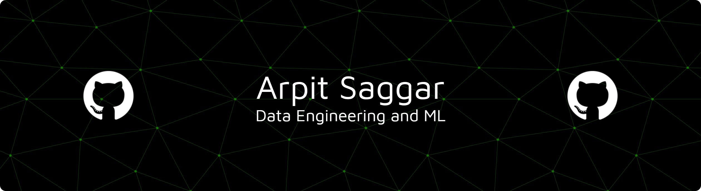



  

 Hi! I’m Arpit Saggar

I’m a software engineer who loves building **data pipelines**, **backend systems**, and **automation**, and sharing what I learn along the way.

- **Currently working on:** data pipelines and open-source experiments  
- **Currently learning:** Kafka, PySpark, Transformers  
- **Open to collaborating on:** web apps, data engineering projects, automation  
- **Reach me at:** asaggar_be24@thapar.edu  

---

## About Me

  

I enjoy solving problems at the intersection of data, systems, and infrastructure.  
My interests span from real-time streaming systems to production-ready ML pipelines.

---

## 🛠️ Tech & Tools
- **Languages:** Python, C++, JavaScript  
- **Backend / Data / Infra:** Kafka, PySpark, Node.js, Express  
- **ML / Data Science:** Transformers, scikit-learn, pandas  
- **Frontend:** React, Next.js  
- **DevOps:** Docker, GitHub Actions, Git  
- **Databases:** PostgreSQL, MongoDB  

---

## Contribution Activity

---

## 🎧 Spotify — Now Playing

---

## ⏳ Timeline
- **2025:** Data Engineering Internship  
- **2026:** Open-source streaming projects  
- **2027:** Focus on production ML & scalable data systems  

---
